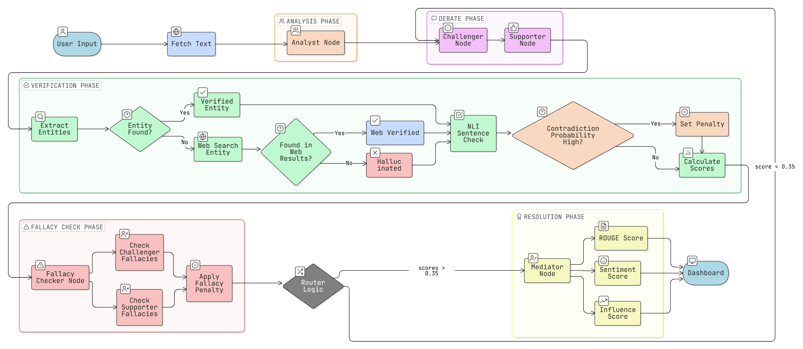

# Dialectic AI: The Verifiable News Synthesis Engine

**Live Application:** [dialectic-ai-ahdhkarxnqe9m7bddt5jhw.streamlit.app](https://dialectic-ai-ahdhkarxnqe9m7bddt5jhw.streamlit.app/)

Dialectic AI is a research-grade NLP system designed to address media bias and AI hallucinations through an adversarial, fact-grounded Dialectic framework. It is a LangGraph powered multi-agent debate system for synthesizing neutral news through RAG based fact checking and iterative reflexion loops

## The Core Philosophy: The Dialectic
Inspired by the Hegelian Dialectic (Thesis + Antithesis = Synthesis), this project moves beyond simple summarization. Modern news is often polarized; Dialectic AI neutralizes this by forcing two specialized agents into a controlled debate:
* **The Supporter (Thesis):** Defends the core claims of the input text.
* **The Challenger (Antithesis):** Scrutinizes biases, identifying logical leaps and omissions.
* **The Mediator (Synthesis):** Evaluates the debate, prioritizes factually grounded arguments, and produces a final, objective synthesis.

## High-Level Architecture
Built on LangGraph, the system operates as a multi-agent state machine. Unlike a linear prompt chain, Dialectic AI features cyclic reasoning and autonomous Reflexion loops.



### The Graph Pipeline
1. Analyst Node: Dynamically assigns professional personas to the agents based on the article's topic.
2. Adversarial Nodes: Challenger and Supporter agents generate contrasting summaries of the news.
3. Fact-Checker Node: An algorithmic engine that performs deep linguistic cross-referencing between the AI's claims and the source.
4. Fallacy Detector: A node that uses Chain-of-Thought (CoT) to critique the agents' logic.
5. Router Logic: If an agent's Authority Score is too low, the graph autonomously loops back for a Reflexion rewrite.
6. Mediator Node: Synthesizes the final report using the most verified points from both sides.

## Advanced RAG and Multi-Source Grounding
This project utilizes a multi-layered Retrieval-Augmented Generation (RAG) pipeline:
* URL Scraper RAG: Automatically fetches and cleans HTML from live article links.
* Just-In-Time Entity RAG: During verification, if an agent brings in a fact not in the source text, the system invokes the DuckDuckGo Search API in real-time to distinguish between helpful context and hallucination.

## Technical Stack
* Inference Cloud: Groq (Llama 3.3-70b & Qwen-32b) for high-reasoning debate rounds.
* NER Engine: spaCy (en_core_web_md) for localized entity tracking.
* Semantic Verification: DeBERTa-v3-small Cross-Encoder for Natural Language Inference (NLI), detecting contradictions between AI claims and source data.
* Quantified Truth: Calculation of ROUGE (Information Conservation) and Sentiment Neutrality metrics.

## Deployment and Setup

### Streamlit Cloud
This app is optimized for Streamlit Cloud deployment.
1. Fork this repository.
2. Connect to Streamlit Cloud.
3. Add your GROQ_API_KEY to the Secrets management on the Streamlit dashboard.

### Local Installation
1. Clone the repository:
   ```bash
   git clone https://github.com/Prateek-845/Dialectic-AI.git
   cd Dialectic-AI
   ```
2. Install dependencies:
   ```bash
   pip install -r requirements.txt
   python -m spacy download en_core_web_md
   ```
3. Set environment variables: Create a .env file with your GROQ_API_KEY.
4. Run the application:
   ```bash
   python -m streamlit run app.py
   ```

## Quantitative Authority Metrics
Dialectic AI provides a visual Confidence Map using color-coded HTML highlights:
* Verified: Claim was found directly in the source text.
* Web-Verified: Claim was confirmed via real-time DuckDuckGo RAG search.
* Unverified: Potential hallucination - heavily penalized in the Authority Score.

## License
MIT License. Built for ethical AI research.
