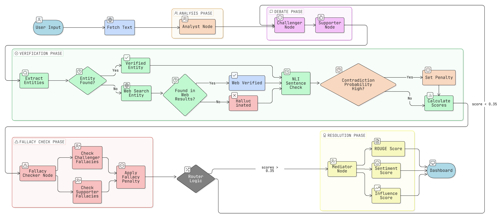

# Dialectic AI

Dialectic AI is a full-stack multi-agent debate platform. It takes an article or URL and uses specialized LLM personas to debate its claims in a structured, fact-checked environment before generating a neutral summary.

The application uses a MERN stack alongside FastAPI and LangGraph for real-time streaming, human-in-the-loop interventions, and factual verification.

## Architecture

The system is separated into three services:

1. Frontend (React, Vite, Tailwind CSS)
Handles real-time Server-Sent Events (SSE) streaming, user authentication, and interactive metric displays for ROUGE scores and Polarity Bias.

2. Backend (Node.js, Express, MongoDB)
Manages JWT Authentication, proxies the SSE stream from the AI engine, and stores debate history in MongoDB Atlas.

3. AI Engine (Python, FastAPI, LangGraph)
Uses LangGraph to orchestrate a cyclic graph of AI agents and streams outputs to the Node server.

## Features

* Multi-Agent Debate: A Challenger agent attacks claims, a Supporter defends them, and a Mediator synthesizes the arguments.
* Streaming: UI updates in real-time as agents formulate arguments.
* Fact Checking: Performs DuckDuckGo web searches to incorporate external context.
* Entity Verification: Color-codes entities based on factual verification (verified in text, verified via web, or unverified).
* Fallacy Checking: Utilizes a DeBERTa Cross-Encoder to detect logical contradictions between summaries and source text (bypassed on cloud deployments to prevent memory limits).
* Human-in-the-Loop: Pauses the debate for human guidance if a logical error is detected.
* Metrics: Calculates ROUGE scores for information conservation, TextBlob Polarity for bias reduction, and debate influence to determine which agent affected the summary more.

## Agent Workflow



1. Analyst: Scrapes the URL and defines personas.
2. Challenger (Agent A): Reads the article, runs a web search, and attacks the claims.
3. Supporter (Agent B): Defends the article against specific points raised by the Challenger.
4. Fact Checker: Uses spaCy to extract Named Entities and verifies them against the source and web context.
5. Fallacy Checker: Checks for logical contradictions. Routes back to the Challenger for a rewrite if scores are low, or pauses for human intervention on critical errors.
6. Mediator: Synthesizes the debate into a neutral summary and calculates final metrics.

## Local Installation

Requires three separate terminals.

Python AI Engine:
```bash
cd ai_engine
python -m venv .venv
# Activate venv: .venv\Scripts\activate (Windows) or source .venv/bin/activate (Mac/Linux)
pip install -r ../requirements.txt
```
Create a .env file in the root directory with your GROQ_API_KEY.
```bash
python main.py
```

Node Backend:
```bash
cd backend
npm install
node server.js
```

React Frontend:
```bash
cd frontend
npm install
npm run dev
```

## Cloud Deployment

The application is designed for a distributed cloud architecture, with different services hosted on platforms optimized for their specific runtime requirements:

1. Database Layer (MongoDB Atlas)
The primary data store is hosted on MongoDB Atlas using an M0 Cluster. It is configured to accept connections from the cloud environments and stores all user data, debate histories, and synthesized metrics.

2. AI Engine (Render)
The FastAPI Python engine is deployed as a Web Service on Render. It runs on a Python 3.11 environment to ensure compatibility with modern AI packages like LangGraph and DuckDuckGo Search. It receives requests from the Node backend, executes the multi-agent graph, and streams the output back over HTTP.

3. Node Backend (Render)
The Express.js server is also hosted on Render as a separate Node environment. It acts as a secure middleware layer that connects directly to the MongoDB cluster via a secure URI and proxies the Server-Sent Events (SSE) from the AI engine to the frontend.

4. React Frontend (Vercel)
The client-side Vite React application is deployed on Vercel's Edge Network for maximum global performance. It connects to the Node backend via standard REST endpoints and maintains the live SSE connection for the real-time debate UI.
